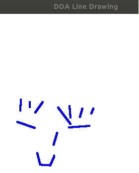
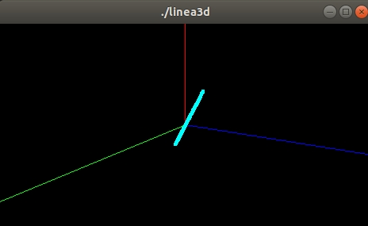
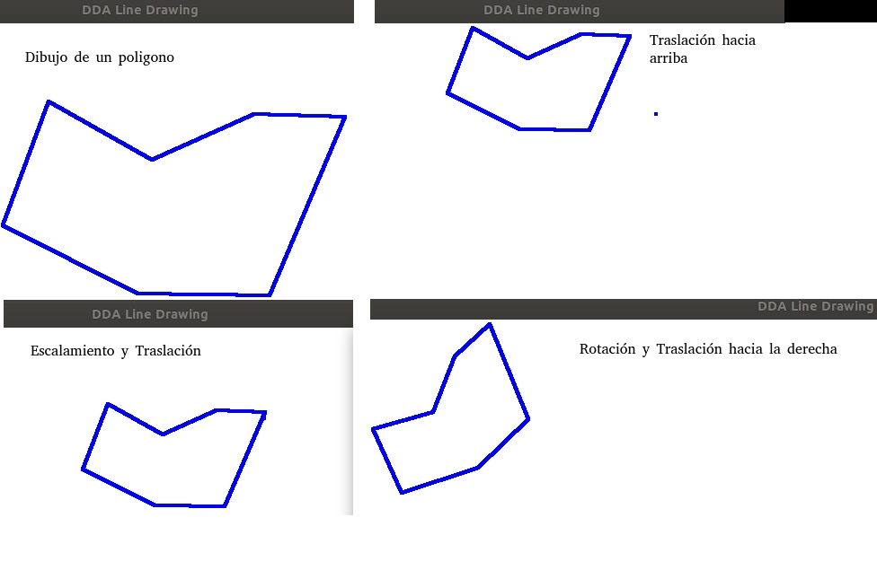
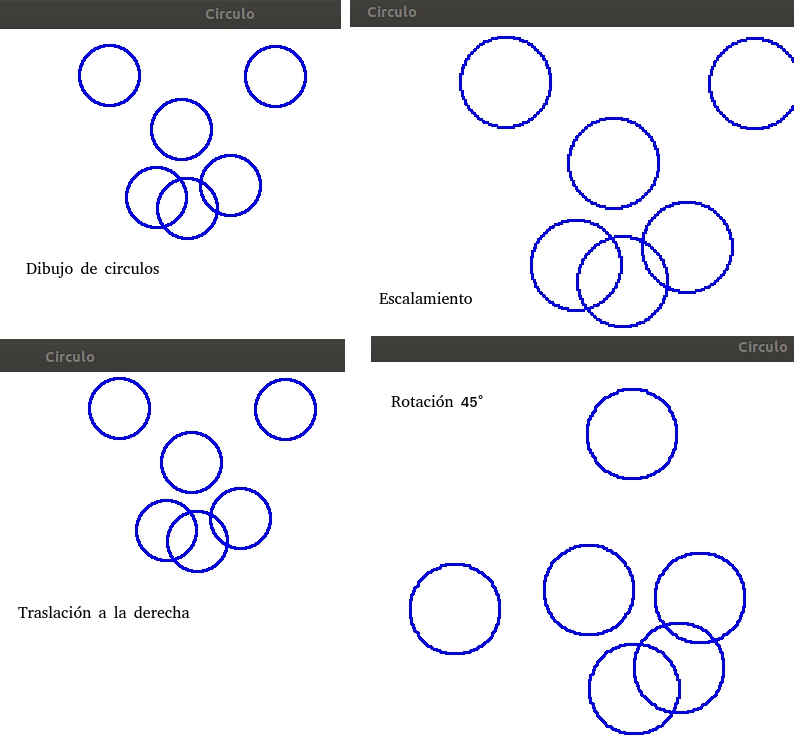

# Lineagrafica
Se desarrolla los siguientes algoritmos con Opengl y c++ y son:
1. **Linea en 2d** : Apretando el click derecho del mouse hasta el punto final de la recta a dibujar Se uso la tecnia de DDA, punto medio y incremento. Obteniendo el mejor resultado en DDA como se muestra a continuación.

2. **Linea en 3d** : En este caso es estatica le dimos dos puntos a dibujar. Se uso la tecnia de DDA, incremento. Oteniendo el mejor resultado en el incremento como se muestra a continuación.

3. **Poligonos**: Para cada vertice se pulsa el click derecho del mouse cuando se acabe con todos los vertices, se pulsa el anticlick de mouse, entonces mostrara el poligono. 
De este poligono se hizo las siguientes transformaciónes:
    * Traslación.- Se puede mover mediante el uso de las direccionales del teclado.
    * Escalamiento.- Se puede agrandar o disminuir  el poligono pulsando la tecla shift.
    * Rotación.- Se puede girar el poligono a 45 grados con punto de referencia 200.
 
    * Rellenado.- Una vez graficado el poligono se pulsa control para pintarlo.
 
4. **Circulo**: Se pulsa en la pantalla en cualquier lado entonces se dibujara automaticamente un circulo, puede haber varios circulos. Con uno o varios circulos se puede trasladar, escalar, rotar.

Se explica con detalle todos los metodos y programación  en el " informe.pdf ".
Me base en el libro de **Gráficos por computadora con OpenGL**
